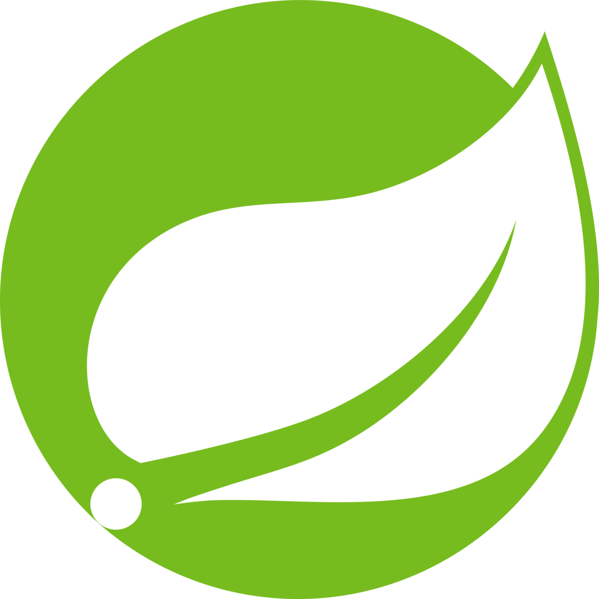
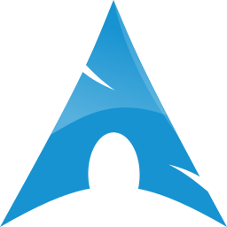

<!-- 
GIF SECTION

If you wanna know how i made this gif

I made this with my repo: (https://github.com/HarshS1611/GitHub_ProfileReadmeGIF)
There i made and page with the GIF content, later i record my screen with OBS
after that i converter the video from mp4 to gif
ur welcome ;) 
-->

<!-- Social icons section -->
<h1 align="center"> Social Media: </h1>
  

    
    
    
  

</h1>

<!-- Description about me -->
<h2 align="center"> 🤔 About me 👨‍💻 </h2>

Heyy!!!  
I am <b>Harsh Singh</b>.  
I am from <strong>India 🇮🇳🇮🇳</strong>.  
I'm a guy who loves to develop new things 🖥️  
I am a <b>full stack web3</b> developer with proficiency in NextJs and MERN stack in both web2 and web3 space with solidity as the medium for implementing smart contracts to build scalable, secure, and user-friendly web applications. 🚀🚀
 
If you are interested in a guy with a good vibe who loves knowledge and constant learning 📚, <b>⚙️I AM YOUR GUY⚙️</b>  
Contact me for new projects 📨, I am open to collaborate with you
   

### 🧐 More About Me:
<table style="border: none;">
  <tr style="border: none;">
    <td style="border: none;">
      <ul>
        <li>
          🔭 I’m currently studying at **SENA**
        </li>
        <li>
          🤝 I’m looking to collaborate on Open Source projects and new opportunities.
        </li>
        <li>
          🌱 I’m currently learning Solidity.
        </li>
        <li>
          👨🏻‍💻 Most of my projects are available on [Github](https://github.com/HarshS1611?tab=repositories)
        </li>
        <li>
          💬 Ask me about anything tech-related, and I am happy to help (if you have questions with full stack development you can ask me🐧);
        </li>
        <li>
          📫 Feel free to contact me on [LinkedIn](https://www.linkedin.com/in/harsh-singh-7993bb1a3/)
        </li>
        <li>
          📝 Checkout my [Twitter](https://twitter.com/harshS_16) 
        </li>
    </td>
    <td style="border: none;">
      
    </td>
  </tr>
</table>
   

<!-- languages and skills section -->

<h1 align="center"> Languages/Frameworks I'm good at: </h1>

  <code></code>
  <code></code>
  <code></code>
  <code></code>
  <code></code>
  <code></code>
  <code></code>

 

<h1 align="center"> Languages/Frameworks I'm learning: </h1>

  <code></code>
  
  <code></code>
  <code></code>
  <code></code>

 

<h1 align="center"> Environments I work with: </h1>

  <code></code>
  <code></code>
  <code></code>
  <code></code>

 

<!-- GitHub stats section -->

## 📊 Github stats

<!-- Bassed on: https://github.com/anuraghazra/github-readme-stats -->

   
  
  
   
  <b>Note:</b> Top languages is only a metric of the languages my public code consists of and doesn't reflect experience or skill level.

<!-- Projects section -->

## 📘 My top open source projects

<!-- Bassed on: Repo info cards - https://github.com/anuraghazra/github-readme-stats -->

  

    
    
  

  
&#8192;

  

    
    
  

&#8192;

&#8192;

  

<!-- last activity section -->

## Activity Graph

  

 

<!-- last refresh of readme section -->

Last refresh: <b>Tuesday, July 16, 7:50 PM GMT-5</b>

<!---
DavidsDvm/DavidsDvm is a ✨ special ✨ repository because its `README.md` (this file) appears on your GitHub profile.
You can click the Preview link to take a look at your changes.
--->
